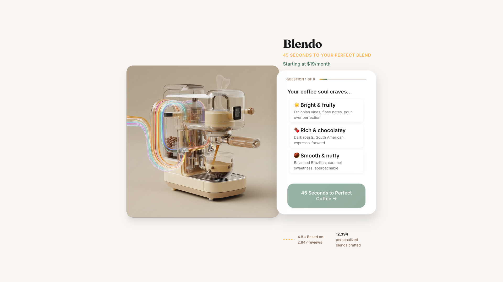

# ☕ Blendo - Personalized Coffee Subscription

**60-Minute Vibecoding Challenge at TED AI Vienna**

A production-ready React application for a personalized coffee subscription service featuring an interactive taste quiz and dynamic blend generation. Built as a rapid development challenge to showcase modern web development capabilities in just one hour.

## 🎯 Challenge Context

This project was created during the TED AI Vienna event as a 60-minute vibecoding challenge to demonstrate:
- Modern React development practices
- AI-assisted coding workflows
- Rapid prototyping and deployment
- Production-quality code under time constraints

## 🖼️ Live Application

[](https://blendo-ted.netlify.app/)

*The complete Blendo application featuring the coffee machine video, interactive quiz, and elegant glassmorphism design.*

**[🚀 Try the Live Demo →](https://blendo-ted.netlify.app/)**

## 🚀 Quick Start

```bash
# Install dependencies
npm install

# Start development server
npm run dev

# Build for production
npm run build

# Preview production build
npm run preview
```

The application will be available at `http://localhost:5173/`

## 📋 Features

### 🎯 Core Functionality
- **Interactive 6-Question Quiz**: Taste preference analysis with multiple input types
- **Dynamic Blend Generation**: Personalized coffee recommendations based on user responses
- **Responsive Design**: Mobile-first approach with desktop enhancements
- **Video Background**: Looping coffee machine animation with smart fallbacks

### ♿ Accessibility
- **WCAG 2.1 AA Compliant**: Comprehensive accessibility implementation
- **Screen Reader Support**: Proper semantic HTML and ARIA labels
- **Keyboard Navigation**: Full keyboard accessibility with focus management
- **Reduced Motion Support**: Respects user motion preferences
- **High Contrast Mode**: Enhanced contrast for better readability

### ⚡ Performance
- **Lazy Loading**: Videos and images load only when needed
- **Code Splitting**: Optimized bundle sizes
- **Core Web Vitals**: Monitored and optimized for best performance
- **Adaptive Loading**: Content adapts to network conditions

### 📊 Analytics
- **Comprehensive Tracking**: Full user journey analytics
- **Performance Monitoring**: Core Web Vitals and load times
- **Error Tracking**: Automatic error reporting and context

## 🏗️ Architecture

### Tech Stack
- **Frontend**: React 18 + Vite
- **Styling**: SCSS with design tokens
- **State Management**: React Context API
- **Build Tool**: Vite
- **Package Manager**: npm

### Project Structure
```
src/
├── components/          # React components
│   ├── Hero/           # Landing page hero section
│   ├── Quiz/           # Interactive quiz wizard
│   └── Result/         # Results and plan selection
├── context/            # React context providers
│   └── QuizContext.jsx # Quiz state management
├── styles/             # SCSS stylesheets
│   ├── _tokens.scss    # Design tokens
│   ├── global.scss     # Global styles
│   └── components/     # Component-specific styles
├── utils/              # Utility functions
│   ├── accessibility.js # A11y helpers
│   ├── analytics.js    # Analytics tracking
│   ├── performance.js  # Performance utilities
│   └── quizLogic.js    # Quiz result generation
└── App.jsx            # Main application component

public/
└── assets/            # Static media files
    ├── hero_loop_desktop.mp4
    ├── hero_loop_mobile.mp4
    ├── hero_still.jpg
    └── flavor_icons.svg
```

## 🎨 Design System

### Color Palette
The application uses a coffee-inspired color palette defined in `src/styles/_tokens.scss`:

- **Coffee Tones**: `--coffee-100` to `--coffee-800`
- **Accent Colors**: `--accent-amber`, `--accent-forest`
- **Semantic Colors**: Primary, secondary, surface variants

### Typography
- **Display Font**: Fraunces (serif) for headlines
- **Body Font**: Inter (sans-serif) for content
- **Fluid Scaling**: CSS `clamp()` for responsive typography

### Spacing & Layout
- **8px Grid System**: Consistent spacing scale
- **Container Queries**: Responsive breakpoints
- **Flexbox & CSS Grid**: Modern layout techniques

## 🧩 Key Components

### Hero Section
- Two-column responsive layout
- Video background with WebM/MP4 fallbacks
- Inline first quiz question for reduced friction
- Social proof and trust signals

### Quiz Wizard
- 6 interactive questions with different input types:
  1. **Radio**: Coffee drinking preferences
  2. **Radio with Visual**: Roast preference with bean strip
  3. **Multi-select**: Flavor preferences (up to 3)
  4. **Slider**: Bitterness tolerance
  5. **Radio**: Brewing method
  6. **Radio**: Caffeine sensitivity
- Progress tracking and navigation
- Skip functionality for uncertain users

### Result View
- Personalized blend generation
- Visual coffee bag mockup
- Tasting notes and origin breakdown
- Plan selection and guarantee information

## 🔧 Customization

### Replacing Media Assets

Replace placeholder files in `public/assets/` with your actual media:

1. **Hero Videos**:
   - `hero_loop_desktop.mp4` (recommended: 1920x1080, 10-15 seconds)
   - `hero_loop_mobile.mp4` (recommended: 750x1334, 10-15 seconds)
   - Include WebM versions for better compression

2. **Hero Image**:
   - `hero_still.jpg` (fallback image, same dimensions as desktop video)

3. **Flavor Icons**:
   - `flavor_icons.svg` (contains icons for all 7 flavor options)

### Design Token Customization

Modify `src/styles/_tokens.scss` to customize:

- **Colors**: Update CSS custom properties in `:root`
- **Typography**: Adjust font families and sizes
- **Spacing**: Modify the spacing scale
- **Breakpoints**: Update responsive breakpoints

Example:
```scss
:root {
  --coffee-800: #your-primary-color;
  --accent-amber: #your-accent-color;
  --space-lg: 2rem; // Adjust spacing
}
```

### Quiz Logic Customization

The quiz result generation logic is located in `src/utils/quizLogic.js`:

```javascript
// Customize blend names
const BLEND_NAMES = [
  'Your Blend 01',
  'Custom Roast',
  // Add your blend names
];

// Modify flavor profiles
const FLAVOR_PROFILES = {
  chocolate: {
    notes: ['Your chocolate notes'],
    roastPreference: 'medium'
  }
  // Customize flavor mappings
};
```

### Analytics Configuration

Configure analytics in `src/utils/analytics.js`:

```javascript
// Add your analytics service integrations
sendToAnalyticsServices(eventData) {
  // Google Analytics 4
  gtag('event', eventData.event, eventData.properties);

  // Your custom analytics endpoint
  fetch('/api/analytics', {
    method: 'POST',
    body: JSON.stringify(eventData)
  });
}
```

## 🔍 Development

### Available Scripts

```bash
# Development
npm run dev              # Start dev server
npm run dev:host         # Start dev server with network access

# Building
npm run build            # Build for production
npm run preview          # Preview production build locally

# Code Quality
npm run lint             # Run ESLint
npm run lint:fix         # Fix ESLint issues automatically

# Testing
npm test                 # Run tests (add your test framework)
```

### Development Guidelines

1. **Component Structure**: Keep components focused and single-purpose
2. **Styling**: Use SCSS modules and design tokens
3. **Accessibility**: Test with screen readers and keyboard navigation
4. **Performance**: Monitor bundle sizes and Core Web Vitals
5. **Analytics**: Add tracking for user interactions

### Browser Support

- **Modern Browsers**: Chrome 88+, Firefox 85+, Safari 14+, Edge 88+
- **Progressive Enhancement**: Graceful degradation for older browsers
- **Mobile Support**: iOS 13+, Android 8+

## 📱 Responsive Design

### Breakpoints
- **Mobile**: < 768px
- **Tablet**: 768px - 1024px
- **Desktop**: > 1024px
- **Large Desktop**: > 1280px

### Mobile-First Approach
The application is built mobile-first with progressive enhancement for larger screens.

## 🎯 Performance Metrics

### Target Core Web Vitals
- **LCP (Largest Contentful Paint)**: < 2.5s
- **FID (First Input Delay)**: < 100ms
- **CLS (Cumulative Layout Shift)**: < 0.1

### Optimization Techniques
- Lazy loading for media assets
- Code splitting for components
- Image optimization with modern formats
- Critical CSS inlining
- Resource preloading

## 🔒 Security

- **Content Security Policy**: Configured for media and fonts
- **XSS Protection**: React's built-in protections
- **Data Sanitization**: User inputs are properly handled
- **Privacy**: No sensitive data stored in localStorage

## 🤝 Contributing

1. Fork the repository
2. Create a feature branch (`git checkout -b feature/amazing-feature`)
3. Commit your changes (`git commit -m 'Add amazing feature'`)
4. Push to the branch (`git push origin feature/amazing-feature`)
5. Open a Pull Request

### Code Style
- Use Prettier for formatting
- Follow React best practices
- Write accessible HTML
- Use semantic commit messages

## 📄 License

This project is licensed under the MIT License - see the [LICENSE.md](LICENSE.md) file for details.

## 🙋‍♂️ Support

For questions or issues:

1. Check the existing [Issues](https://github.com/your-repo/issues)
2. Create a new issue with detailed information
3. Include browser version and steps to reproduce

## 🚀 Deployment

This project is optimized for Netlify deployment with automatic builds from GitHub.

### Quick Deploy to Netlify

1. **GitHub Integration**: Push to GitHub repository
2. **Netlify Setup**: Connect repository to Netlify
3. **Auto Deploy**: Netlify will automatically build and deploy on push

### Manual Deployment
```bash
npm run build
# Upload dist/ folder to any static hosting service
```

### Build Configuration
- Build command: `npm run build`
- Publish directory: `dist`
- Node version: 18

---

Built with ❤️ for coffee lovers everywhere ☕